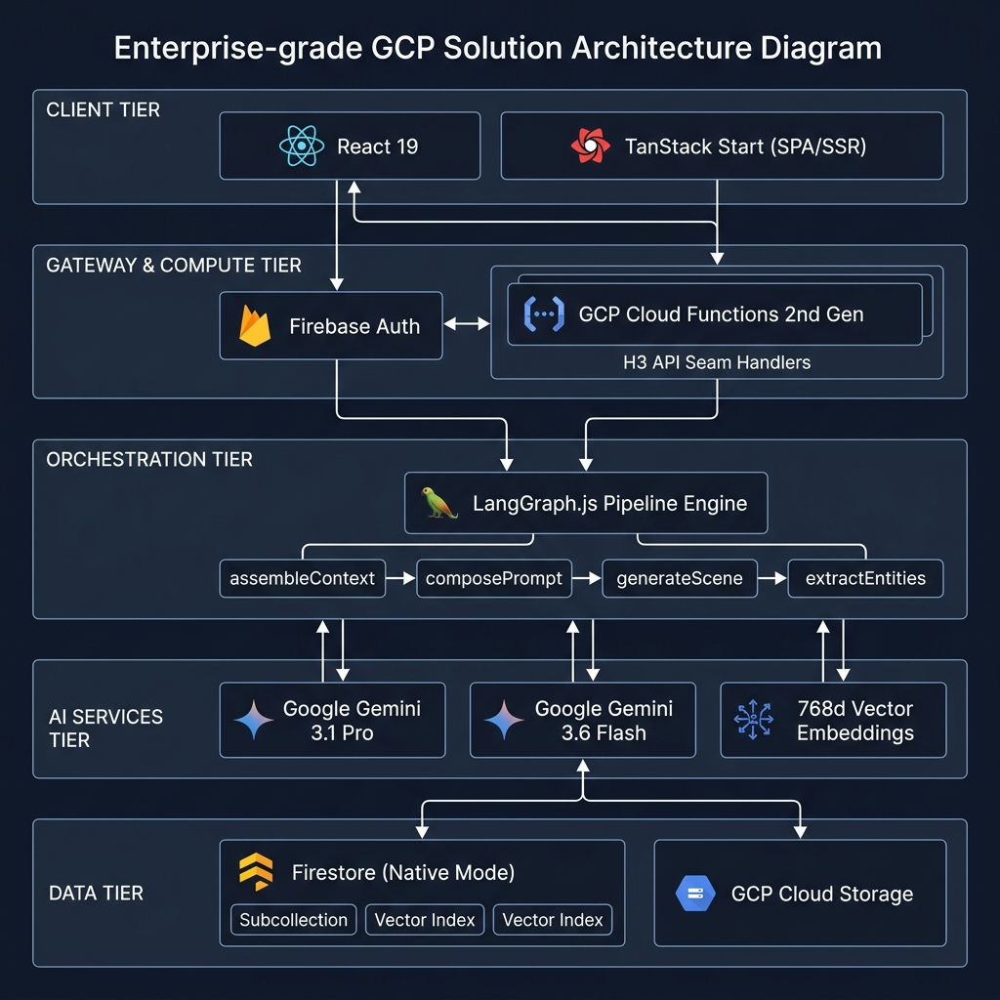

# Story

Story is a private AI-assisted novel writing workspace. The current app is a Firebase-hosted React/TanStack Start frontend backed by Firebase Auth, Firestore, Cloud Functions, and a model-registry-driven AI layer.

The implemented writing flow covers private book intake, scene generation and refinement,
long-book context, Muse guidance, manuscript preview, snapshots, export, and book deletion.



## Current Capabilities

- Private Firebase Auth sign-in for the approved writer accounts.
- Route protection for authenticated app areas.
- Guided chat-style book intake at `/books/new`.
- Atomic book creation with one Book, one opening Chapter, one Vision Document, and ordered intake messages.
- Muse opening suggestions after intake, with 2-3 candidate openings and one-line rationales.
- Non-blocking retry path for opening suggestions through `/retryOpeningSuggestion`.
- Book Chat with free-text, quick-detail, and draft-polish generation modes.
- Inline scene review with regenerate, edit, accept, and chapter creation workflows.
- Ordered manuscript preview at `/books/{bookId}/manuscript`, showing accepted prose only.
- Chapter contents navigation, word/page estimates, print layout, Markdown export, and plain-text export.
- Vision editing, narrative threads, style changes, Muse notes, and usage visibility.
- Named snapshots with compare and coherent restore.
- Ownership-scoped recursive book deletion.
- Background entity extraction, embeddings, chapter summaries, and long-book context retrieval.
- Usage logging under `books/{bookId}/usage`.
- Firestore ownership rules scoped under each `books/{bookId}` root.
- CI deploy workflow that runs frontend tests, frontend build, functions verification, model-registry seeding, and Firebase deploy.

## Stack

| Layer | Technology |
| --- | --- |
| Frontend | React 19, TanStack Start/Router, Vite 8 |
| UI | Tailwind CSS v4, Radix UI, Lucide icons |
| Runtime | Bun for frontend tooling, Node.js 22 for functions |
| Backend | Firebase Hosting, Firebase Auth, Firestore, Cloud Functions v2 |
| AI orchestration | LangGraph.js pipelines in `functions/src/pipelines` |
| AI providers | OpenAI/Gemini text-provider registry, Gemini embeddings |
| Tests | Vitest, Testing Library, functions seam lint |

## Repository Layout

```text
src/
  lib/                  Frontend Firebase auth and authenticated fetch helpers
  routes/               TanStack file routes, including guided book intake
functions/
  src/handlers/         HTTP function handlers
  src/pipelines/        LangGraph pipeline entry points
  src/services/         Firestore, auth, and AI service seams
  scripts/              Operational scripts such as model registry seeding
docs/
  ai-cookbook-patterns.md
public/
  architecture_infographic.png
```

## Local Setup

Install dependencies:

```bash
bun install
cd functions
npm install
cd ..
```

Create a root `.env` for frontend Firebase configuration:

```env
VITE_FIREBASE_API_KEY=...
VITE_FIREBASE_AUTH_DOMAIN=...
VITE_FIREBASE_PROJECT_ID=...
VITE_FIREBASE_APP_ID=...
VITE_FIREBASE_MESSAGING_SENDER_ID=...
VITE_FIREBASE_STORAGE_BUCKET=...
```

Functions read AI keys from Firebase secrets, not from the frontend `.env`:

```bash
firebase functions:secrets:set GOOGLE_API_KEY
firebase functions:secrets:set OPENAI_API_KEY
```

Run the frontend locally:

```bash
bun run dev
```

The dev server opens at `http://localhost:5173`.

## Verification

Frontend:

```bash
bun run test
bun run build
```

Functions:

```bash
cd functions
npm run verify
```

`npm run verify` runs lint, seam lint, TypeScript build, and backend tests.

## Firebase Deployment

The GitHub Actions workflow at `.github/workflows/firebase-deploy.yml` deploys on pushes to `main`.

Required GitHub secrets:

- `FIREBASE_SERVICE_ACCOUNT_JSON`
- `VITE_FIREBASE_API_KEY`
- `VITE_FIREBASE_AUTH_DOMAIN`
- `VITE_FIREBASE_PROJECT_ID`
- `VITE_FIREBASE_APP_ID`
- `VITE_FIREBASE_MESSAGING_SENDER_ID`
- `VITE_FIREBASE_STORAGE_BUCKET`

The workflow seeds `config/geminiModels` before deployment by running:

```bash
cd functions
node scripts/seedModelRegistry.mjs
```

Manual deploys need an authenticated Firebase CLI session or service-account credentials.

## AI Model Registry

Model selection is stored in Firestore at `config/geminiModels`. App code reads it through `functions/src/services/gemini.ts`; handlers and pipelines do not call model providers directly.

The current registry shape supports:

- Text model primary/fallback providers for generation, opening suggestions, Muse notes, summaries, and entity extraction.
- Gemini-only embedding configuration.
- Per-call usage entries recording task, provider, model, and token counts.

## Cookbook Pattern Notes

The reviewed Claude cookbook repository is not vendored into this app. The reusable decisions are captured in [docs/ai-cookbook-patterns.md](docs/ai-cookbook-patterns.md):

- Use structured JSON output for Muse notes, extraction, summaries, and opening suggestions.
- Keep orchestration deterministic through Cloud Functions and LangGraph.js pipeline seams.
- Defer explicit prompt caching until larger Writing Studio generation flows.
- Defer Pinecone-style RAG unless Firestore vector retrieval is no longer enough.
